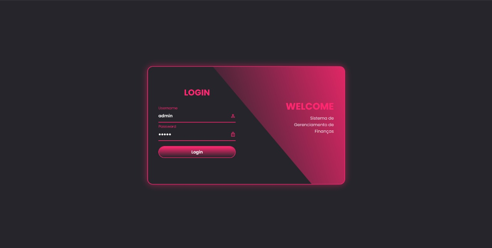
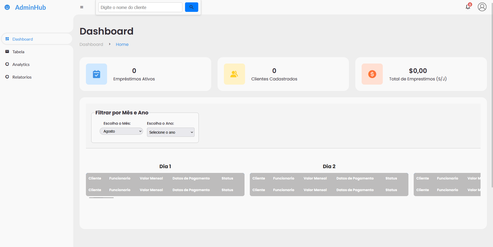
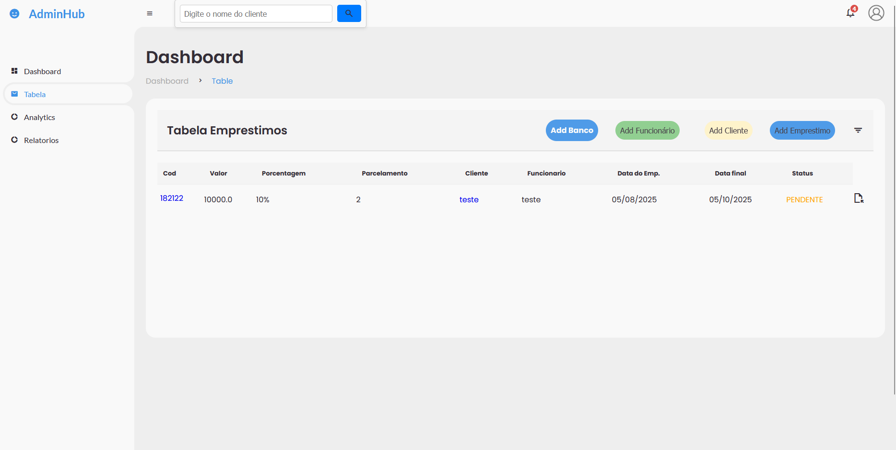
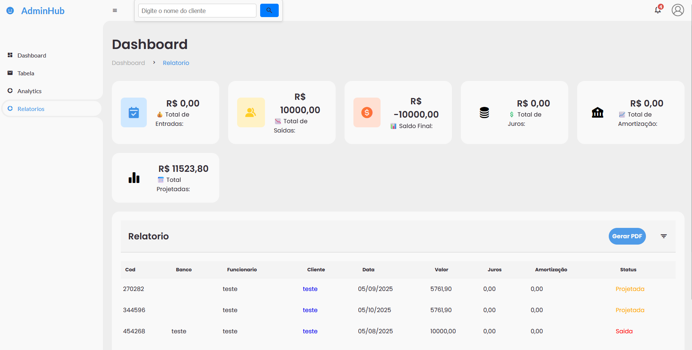
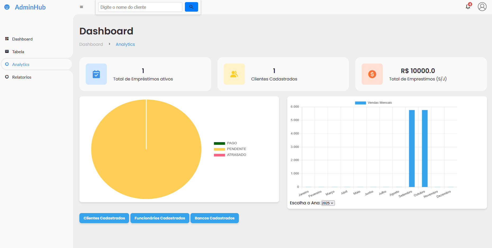

# 📊 Dashboard Finance

**Painel de Controle Financeiro em Java com Spring Boot**

🚀 Controle financeiro inteligente para web — com login seguro, relatórios, histórico de ações, controle de clientes e geração de PDF. Ideal para empresas e sistemas de gestão interna.

---

---

## 📦 Tecnologias Utilizadas

| Backend | Frontend | Segurança | Build |
|--------|----------|-----------|--------|
| Java 23 | HTML5, CSS3, JS | Spring Security | Maven |
| Spring Boot | Thymeleaf | JWT (se aplicável) | `mvnw` |

---

## ✨ funcionalidades

- 🔐 **Login Seguro** com Spring Security 
- 📁 **Cadastro e Edição de Clientes**
- 📈 **Dashboard com Gráficos e KPIs**
- 📃 **Geração de Relatórios e PDFs**
- 🧾 **Histórico de movimentações**
- 🌐 **Front-end responsivo**
- 🔄 **API REST modular**

---

## 📖 Como Usar o Sistema

1. **Acesse o Login**
   - Abra o navegador e acesse o endereço do sistema(localhost:8080).
   - Informe seu **usuário** e **senha** cadastrados. base(admin e admin).
   - Clique em **Entrar**.

2. **Navegação no Dashboard**
   - Após o login, você verá o **painel principal** com gráficos e indicadores financeiros.
   - Use o **menu lateral** para acessar clientes, relatórios, histórico e configurações.

3. **Cadastro de Clientes**
   - No menu, clique em **Clientes** > **Adicionar Cliente**.
   - Preencha os campos obrigatórios e clique em **Salvar**.
  

4. **Geração de Relatórios**
   - Acesse **Relatórios** no menu.
   - Escolha o período e tipo de relatório.
   - Clique em **Gerar PDF** para exportar.

5. **Histórico de Ações**
   - Veja todos os registros de alterações no módulo **Histórico**.
   - Filtre por data, usuário ou tipo de operação.
  

💡 *Dica:* Mantenha seu navegador atualizado para melhor desempenho e segurança.

